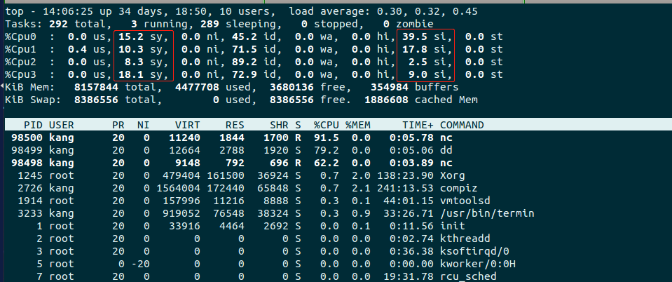
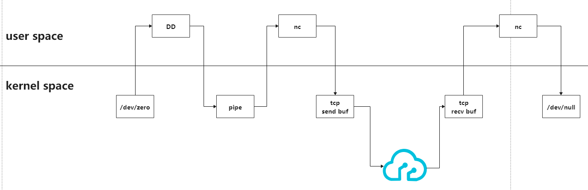

### exp1

>server: nc -l port > /dev/null
client: dd if=/dev/zero bs=1MB count=100 | nc ip port

```
记录了100+0 的读入
记录了100+0 的写出
100000000字节(100 MB)已复制，2.51682 秒，39.7 MB/秒
```

### exp2

>server: nc -l port > /dev/null
client: dd if=/dev/zero bs=1MB count=1000 | nc localhost port

```
记录了10000+0 的读入
记录了10000+0 的写出
10000000000字节(10 GB)已复制，9.7484 秒，1.0 GB/秒
-----------------------------------------------
记录了10000+0 的读入
记录了10000+0 的写出
10000000000字节(10 GB)已复制，10.0362 秒，996 MB/秒
```

### exp3

>server: nc -l port > /dev/null
client: time nc localhost 13245 < ubuntu-20.04-desktop-amd64.iso

```
real	4m20.986s
user	0m0.096s
sys	0m20.192s
----------------
real	0m19.690s
user	0m0.012s
sys	0m3.264s
```
bandwith(first): 2715254784/261/1000000 = 10M B/S(2715254784/21/1024/1024 = 9Mi B/S)
bandwith(second): 2715254784/21/1000000 = 135M B/S(2715254784/21/1024/1024 = 129Mi B/S)

### 实验分析

q:在开始实验1之前，我们先问一个问题，为什么我们要关心tcp的带宽，而不是关心其他层的带宽？
- 这里的问法有问题，我们本质上关心的是application layer的带宽，即tcp payload/udp paylod
- 可以这么理解，买一个1t磁盘的电脑，但是用户使用时不可能是1t，因为用户要使用电脑，必须安装os，后者会占用磁盘空间，所以用户真正的空间没有这么大。
- 也即，如果application layer的数据要通过网络传输，必须增加ethernet overhead/ip overhead/tcp(udp) overhead，即真实的网络带宽需要减去这些overhead，才是applicaton data的带宽

q:exp1的数据和理论相去甚远，原因是什么？
- 网卡性能。我是在docker dev进行的测试，后者的带宽数据我看不到。实验也只是打满了1/3的带宽
- 由于测试时间是完整的接受时间，所以不仅仅和接收端有关，还和发送端的带宽有关。但是这个实验发送端带宽1000M，不影响。
- 还有一个可能就是受nc重定向的影响，因为这相当于消费kernel recv buffer，如果user space消费的慢，那么kernel recv buffer受tcp 滑动窗口影响，即使带宽有富余，也无法接受

q:exp2和exp3的差异是什么？看起来好像都是从设备读？

exp2是从/dev/zero读取，这个虽然理解为设备，但不是真实的设备。可以理解为从内存读

看这个图很明显，cpu主要在kernel space，但同时没有卡在wa. cpu消费在kernel space是有其他消费的地方。
下面我们来开数据在kernel space和user space交互的情况

从这个图中我们可以看出
1.client side，有4次数据在kernel/user之间进行交互，server side有2次，总共是6次。最后统计的时间，是这6次以及途中网络开销的时间
2.这里的kernel space/user space本质都是memory，只不过cpu访问不同的地址状态不一样


参考
[What do top %cpu abbreviations mean?](https://stackoverflow.com/questions/26004507/what-do-top-cpu-abbreviations-mean/26004656)